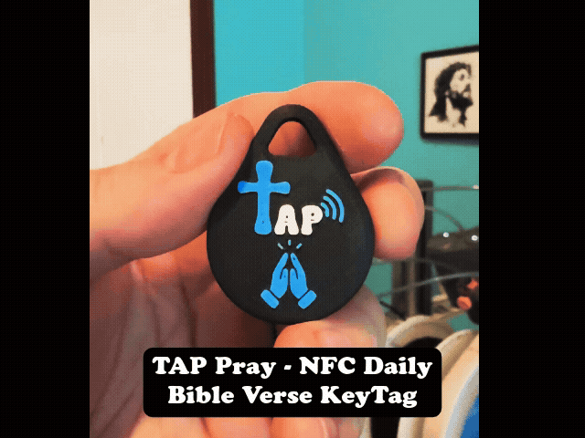

**One Tap. One Verse. One Step Closer to Christ.**

Tap N Pray is a minimalist, immersive web application designed to bring the Word of God into your daily life with simplicity and focus. 
Built for reflection and prayer, it delivers a curated Bible verse experience through a clean, distraction-free interface.

## 🚀 Project Status
For a detailed list of recent mobile optimizations, iOS rendering fixes, and brand-specific UI updates, please refer to the [Full Changelog](./CHANGELOG.md).

**Current Version:** 1.2.3

🌐 👉 [Open Tap N Pray](https://tapnpray.com)
---

## ✨ Core Features

### 📖 Immersive Verse Experience
- **Daily & Random Modes**  
  Start your day with a globally synchronized **Daily Bible Verse** or explore scripture freely using the **Random** toggle.

- **Elite Curated System**  
  Not just random verses — Tap N Pray uses a **weighted system** to prioritize:
  - Cornerstone Gospel passages  
  - Seasonal scriptures (Christmas / Easter)  
  - Thematic verses (Anxiety, Strength, Love, Hope)

- **Multiple Translations**  
  Seamlessly switch between:
  - NLT  
  - NIV  
  - KJV  

---

### 🔊 Read Aloud & Reflection
- **Interactive Audio**  
  Tap any verse to hear it read aloud with high-quality text-to-speech.

- **Real-Time Highlighting**  
  Words highlight as they are spoken, helping you stay focused and meditate deeply.

- **Ambient Soundscape**  
  Toggle the 🌿 button to enable calming background audio for a peaceful prayer experience.

- **Mobile Optimized**  
  Fully responsive and designed to feel like a native app on iOS and Android, including safe-area support.

---

### 🔥 Spiritual Habits
- **Streak Tracking**  
  Build consistency in your walk:
  - 🌿 7 days  
  - 🔥 30 days  
  - 👑 100 days  

- **Visual Progress**  
  Interactive streak card displays your momentum and milestones.

---

### 🎨 Clean UI & Guidance
- **High-Contrast Design**  
  Built for readability with large, clear typography.

- **Smart Guidance**  
  Subtle onboarding tip:  
  *“Tap the verse to listen 🔊”*

- **Social Sharing**  
  Share verses via:
  - Native system share  
  - Custom-generated images  

---

## 🛠️ Technical Overview

- **Frontend**: Vanilla JS / HTML5 / CSS3  
- **Bible Data**: Optimized JSON structures for fast loading  
- **Tracking**: Google Analytics integration  
- **PWA Ready**: Installable for a full-screen, app-like experience  

---

## 🙏 Mission

The mission of **Tap N Pray** is to remove the friction between a busy life and the Word of God.

Through simplicity and thoughtful design, the goal is to help you take **one step closer to Christ every single day**.

---

## 💛 Support the Project

If Tap N Pray has encouraged you, you can support the mission:

👉 [Support on Venmo](https://venmo.com/u/tapnpray)

### What your support helps fund:
- Physical **Tap N Pray keytags**
- Tools to help share Scripture
- Continued app improvements

### Why keytags?
These are designed to:
- Be easily shared  
- Serve as daily reminders  
- Help others discover God’s Word  

---

## ❤️ Created For

Built with love for the Kingdom.
